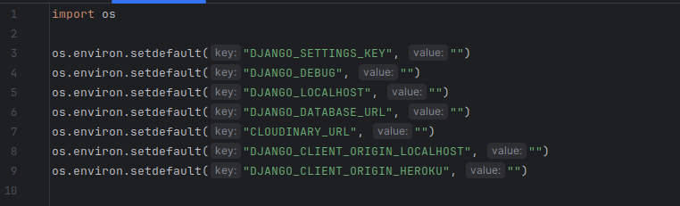
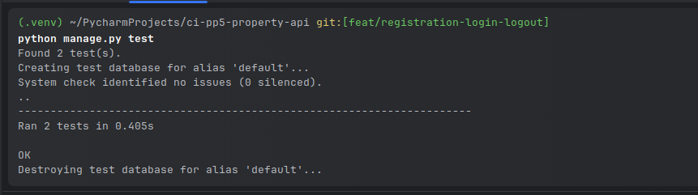
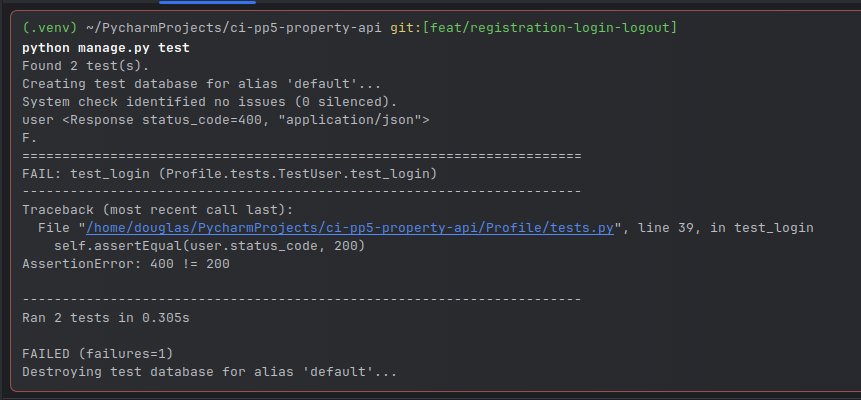

# Property UK

---

---

## Descriptions

- This is the second stage of my property website
- This repository is responsible for the database
- It will be responsible for Registering, login, logout

Live site [here](https://ci-pp5-property-api-958077e8a5b4.herokuapp.com/)

---

[//]: # (Badges)

---

## Table of content

- [Planning](#planning)
    - [ERD diagrams for mapping out my models](#erd-diagrams-for-mapping-out-my-models)
    - [User Stories using MOSCOW Prioritization techniques](#user-stories-using-moscow-prioritization-techniques)
    - [A Proper Description of the Technologies used in this API](#a-proper-description-of-the-technologies-used-in-the-api)
    - [Description of how the code is organized](#description-of-how-the-code-is-organized)
- [How to install this project](#how-to-install-this-project)
  - [Installing locally](#installing-locally)
  - [Setup on Heroku](#setup-on-heroku)
  - [Technology Used](#technology-used)
- [Features](#features)
  - [async/await](#asyncawait) 
- [Testing](#testing)
  - [Auto Testing](#auto-testing)
    - [Authentication](#authentication)
    - [Creating a Property](#creating-a-property)
  - [Manual Testing](#manual-testing)
    - [Authentication](#authentication-1)
- [Bugs](#bugs)
  - [Does not want to display data on heroku app](#does-not-want-to-display-data-on-heroku-app)
  - [Cant create superuser the normal way](#cant-create-superuser-the-normal-way)
  - [JSON data are not serializable when sending to React](#json-data-are-not-serializable-when-sending-to-react)
- [Credits](#credits)

___

### [Planning](#planning)

#### [ERD diagrams for mapping out my models](#erd-diagrams-for-mapping-out-my-models)

#### [User Stories using MOSCOW Prioritization techniques](#user-stories-using-moscow-prioritization-techniques)

#### [A Proper Description of the Technologies used in the API](#a-proper-description-of-the-technologies-used-in-the-api)

- Pop Os is a Linux distribution from System76 that I use for development
- Pycharm was used as my IDE as it gives me better features to be more productive
- Django was used as my Backend framework
- Django Rest Framework was used in conjunction with Django to write this API
- Daphne was used to add async/await to my API design
- Sqlite was used as my local database when I was developing locally
- Postgres was used in conjunction with heroku for an online database
- Figma was used to design my ERD diagram
- Heroku was used as my cloud provider

#### [Description of how the code is organized](#table-of-content)

---

### [How to install this project](#table-of-content)

#### [Installing locally](#table-of-content)

- when using ssh
- git clone git@github.com:douglas86/ci-pp5-property-api.git
- when using http
- git clone https://github.com/douglas86/ci-pp5-property-api.git
- make sure to have a look at the runtime.txt file to see what version of python I am using
- then create a virtual environment with that python version
- to see if a virtual environment has been created, the words venv in brackets appear in the terminal
- as I am using pycharm, the virtual environment will start automatically when I start my IDE
- then install all the packages needed for this project using the following command
- pip install -r requirements.txt
- to start the Django server, run the following command
- create an env.py file this is used to store all environment variables
- create the variable needs for this project see the image below
- placing the name of the variables in the empty quotation marks
- make sure to set DJANGO_DEBUG = True when in local development
- django secret keys should never be committed to GitHub
- so if you need one, follow the following link
- [generate a new secret key](https://www.makeuseof.com/django-secret-key-generate-new/#:~:text=You%20can%20accidentally%20make%20your,are%20still%20learning%20about%20GitHub.)
- Then go to [elephantSQL](https://www.elephantsql.com/)
- And create a new database instance to make sure that the version of PostgresSQL is greater than 12
- Once created, then copy and paste the url in the env.py for the DATABASE_URL string
- once that is done, then you can run the command below to run the server
- python manage.py runserver
- you can use ctrl + click on the server name that should open up a web browser at the correct port

env.py

#### [Setup on Heroku](#table-of-content)

- head over to [Heroku Dashboard](https://dashboard.heroku.com/apps)
- create a new app and add all the environment variables to your config vars
- make sure to add DISABLE_COLLECT_STATIC with the value of 1
- if this variable is not used, Heroku will spit out an error
- change DJANGO_DEBUG with the value of False
- make sure that there is a runtime.txt file
- this will tell Heroku what version of python to use
- make sure that requirements.txt is updated
- make sure to see if Heroku hasn't automatically added a build pack for PostgresSQL
- if it has deleted it as this project is using elephantSQL instead
- connect GitHub and the repo to Heroku and build the project

#### [Technology Used](#table-of-content)

- Python—programming language used in this project
- Django Rest Framework - used to develop all api endpoints
- Daphne - python package to give this project async/await capabilities
- PostgresSQL - using elephantSQL for database
- heroku - cloud deployment
- GitHub—version control system
- Pycharm - IDE for development

---

### [Features](#table-of-content)

#### [async/await](#features)

- This Project is set up with Daphne support for async/await tasks

How I got async/await right in this project

- install the package daphne
- $ pip install daphne
- add daphne to the first app in the installed apps list
- delete the variable WSGI_APPLICATION
- replacing it with ASGI_APPLICATION = "app_name.asgi.application"
- then re-run the server
- you are now setup for async/await functionality

---

### [Testing](#table-of-content)

#### [Auto testing](#table-of-content)

##### [Authentication](#table-of-content)

Testing if a user can register

- I first tried registering a user with only username and password
- This then provided me 400 status errors
- Meaning that I didn't provide the correct details to register a user
- It can also do a failing validation test
- When I try and give the password 123 456
- If I enter the correct credentials, it will return an access token and refresh token

Failing Registration Test

Passing Registration Test

Testing if a user can log in

- When I try and log in a user but haven't registered him yet
- Gives me a failing test
- When user is registered
- Then you can log in as long as the validation checks are correct

Passing login test

If you try to login, but you are not registered

Test if a user can log out

- Register user first
- Login user
- Then logout user
- Then check passes

Passing test for a logout user

Test if user can change password

- Register user first
- Then change password
- Test check passes

Passing of changing of passwords

##### [Creating a Property](#table-of-content)

- There were three tests that I ran on this problem

Test 1: If there is no user that is logged in

- First tested for 200 status codes
- It returned a 403 forbidden http code
- When I changed it to 403, the test passed

Test 2: If the logged-in user is not an admin user

- First tested for 201 status codes
- It returned a 403 forbidden http code
- When I changed it to 403, the test passed

Test 3: If the logged-in user is an admin user

- First tested for code 403 as that would be forbidden
- Which failed as an admin is allowed to post data to the server
- Then tested for 201 to create the data which passed

#### [Manual testing](#table-of-content)

##### [Authentication](#table-of-content)

- When I am logged out, I can't get any profile details

- when I am logged in as a user, I can't get profile details

- when I am logged in as the admin, I can see all profile details

---

### [Bugs](#table-of-content)

#### [Does not want to display data on heroku app](#table-of-content)

#### Problem?

- when I go to the heroku live link it doesn't want to display
- data as JSON data

#### Solution?

- Adding a key value pair to REST_FRAMEWORK dictionary did the trick

#### [Cant create superuser the normal way](#table-of-content)

##### Problem?

- I cant seem to create superuser from the terminal
- Then register through postman

##### Solution?

- I had to create the user through Postman first
- then run python shell to create the superuser the long way

#### [JSON data are not serializable when sending to React](#table-of-content)

##### Problem?

- The data has not be serialized when fetching and sending data

##### Solution?

- The First thing was to change the view to async and await
- The Second thing that needed to be done was add the Serializer class
- This was to sterilize the class from raw sql data to json data

- The stock url has been hit with a 200-status code

---

### [Credits](#table-of-content)

---